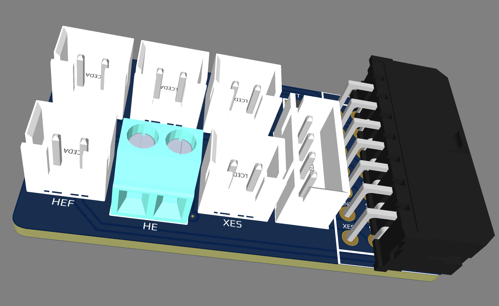
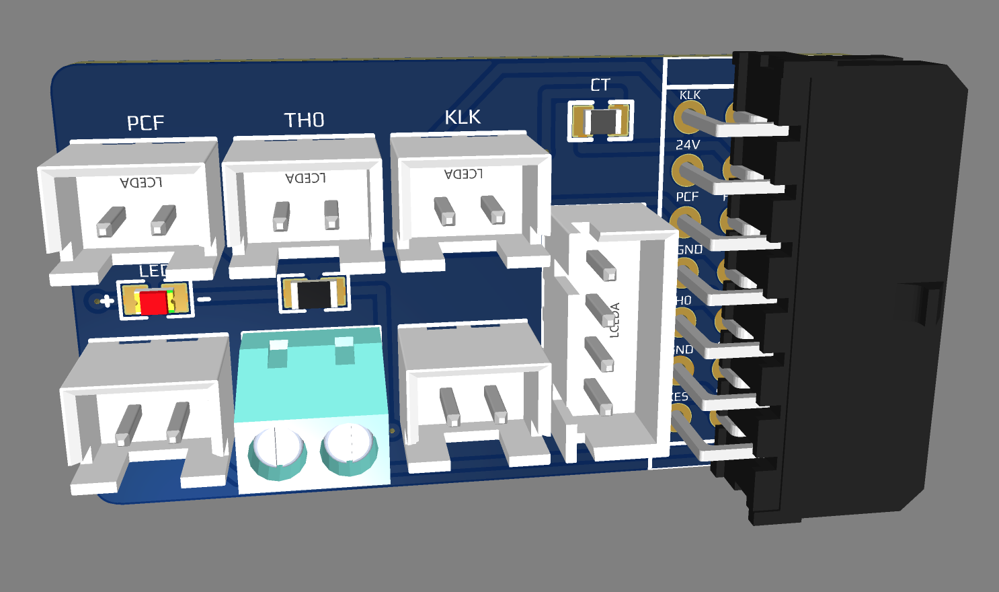
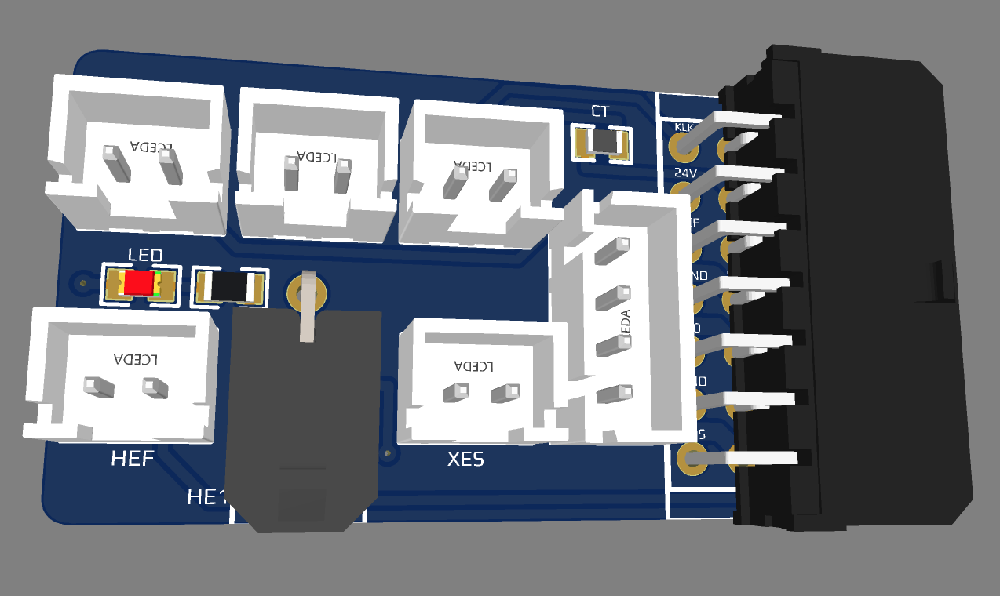
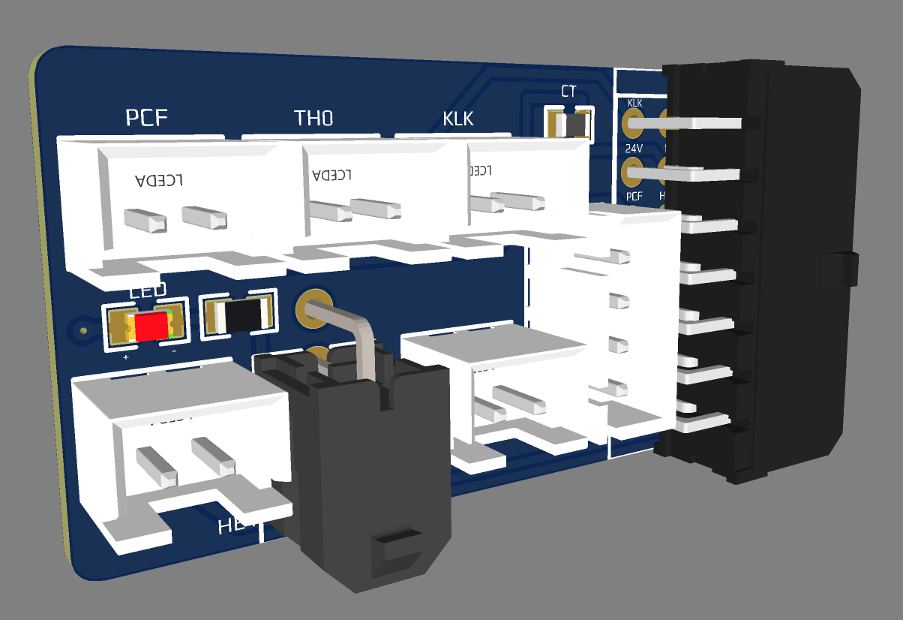
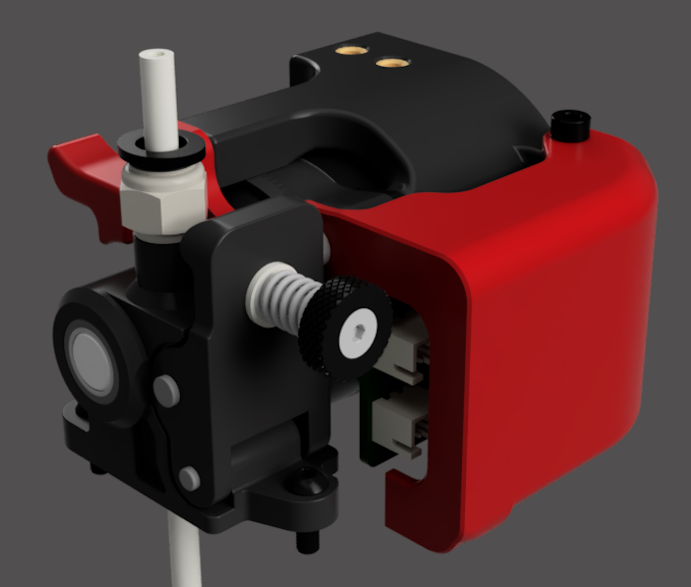
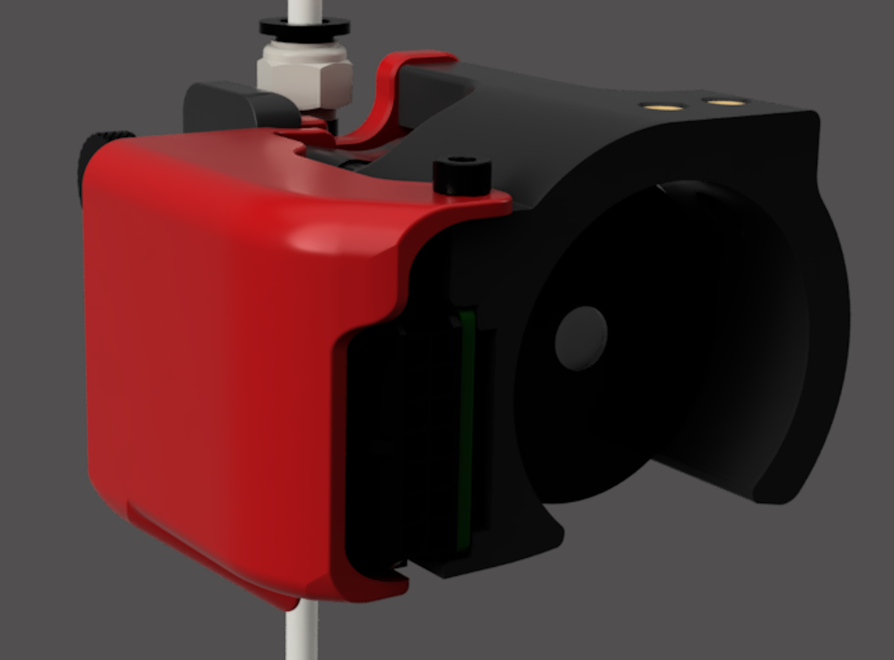
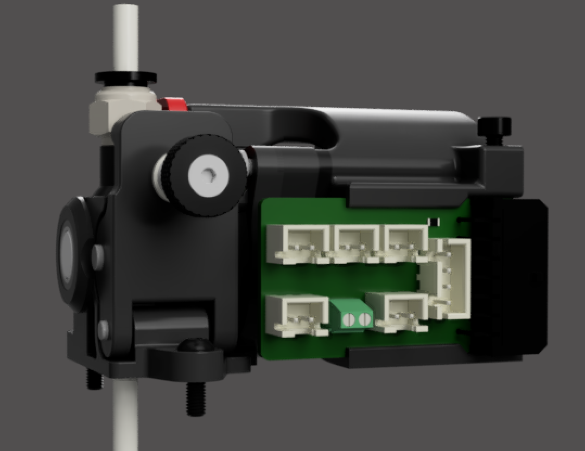

# Voron Afterburner PCBs (Galileo Clockwork and Orbiter v1.5)

These PCBs are a remix of the Afterburner PCB by [hartk](https://github.com/hartk1213/Voron-Hardware/tree/hartk1213/Voron-Hardware/Afterburner_Toolhead_PCB). These are
used only with Klicky since the diode and the 3 pin JST connector have been removed.

Mount and wire cover for Galileo Clockwork can be found [here](https://github.com/thiagolocatelli/Voron/tree/master/Mods/galileo_clockwork_pcb).

### Klick & Chamber Thermistor

#### Screw Terminal version

#### BOM Klicky PCB (Screw Terminal)

| Part      | Quantity | Notes | Manuf Part Number | LCSC Part Number | Link |
| ----------- | :-: | ----------- | ----------- | ----------- |----------- |
| 14 Pin Socket   | 1 | MOLEX | 430451400 | C277677   | [LCSC](https://lcsc.com/product-detail/Wire-To-Board-Wire-To-Wire-Connector_MOLEX-430451400_C277677.html) |
| 14 Pin Plug     | 1 | MOLEX | 430251400 | C293526   | [LCSC](https://lcsc.com/product-detail/Rectangular-Connectors-Housings_MOLEX-430251400_C293526.html) |
| 2 pin JST XH    | 5 | 2.5mm pitch | | C158012   | [LCSC](https://lcsc.com/product-detail/Wire-To-Board-Wire-To-Wire-Connector_JST-Sales-America-B2B-XH-A-LF-SN_C158012.html) |
| 4 pin JST XH    | 3 | 2.5mm pitch | | C144395   | [LCSC](https://lcsc.com/product-detail/Wire-To-Board-Wire-To-Wire-Connector_JST-Sales-America-B4B-XH-A-LF-SN_C144395.html) |
| Screw Terminal  | 1 | 3.5mm pitch | 1751248| C89122 | [LCSC](https://lcsc.com/product-detail/Screw-terminal_Phoenix-Contact-1751248_C89122.html) |
| SMD Thermistor  | 1 | 100K 0805 Thermistor | | C143680   | [LCSC](https://lcsc.com/product-detail/NTC-Thermistors_Vishay-Intertech-NTCS0805E3104FXT_C143680.html) |
| SMD LED         | 1  | red | | C84256 | [LCSC](https://lcsc.com/product-detail/Light-Emitting-Diodes-LED_Foshan-NationStar-Optoelectronics-NCD0805R1_C84256.html) |
| SMD LED         | 1  | blue | | C138557 | [LCSC](https://jlcpcb.com/parts/componentSearch?isSearch=true&searchTxt=BL-HB335A-AV-TRB-6) |
| SMD Resistor (for LED)   | 1  | - | | C4310 | [LCSC](https://lcsc.com/product-detail/Chip-Resistor-Surface-Mount_UNI-ROYAL-Uniroyal-Elec-0805W8F1501T5E_C4310.html)

#### MOLEX Microfit version
                           

#### BOM Klicky PCB

| Part      | Quantity | Notes | Manuf Part Number | LCSC Part Number | Link |
| ----------- | :-: | ----------- | ----------- | ----------- |----------- |
| 14 Pin Socket   | 1 | MOLEX | 430451400 | C277677 | [LCSC](https://lcsc.com/product-detail/Wire-To-Board-Wire-To-Wire-Connector_MOLEX-430451400_C277677.html) |
| 14 Pin Plug     | 1 | MOLEX | 430251400 | C293526 | [LCSC](https://lcsc.com/product-detail/Rectangular-Connectors-Housings_MOLEX-430251400_C293526.html) |
| 2 pin JST XH    | 5 | 2.5mm pitch | | C158012 | [LCSC](https://lcsc.com/product-detail/Wire-To-Board-Wire-To-Wire-Connector_JST-Sales-America-B2B-XH-A-LF-SN_C158012.html) |
| 4 pin JST XH    | 3 | 2.5mm pitch | | C144395 | [LCSC](https://lcsc.com/product-detail/Wire-To-Board-Wire-To-Wire-Connector_JST-Sales-America-B4B-XH-A-LF-SN_C144395.html) |
| 2 pin Socket    | 1 | MOLEX | 43045-0200 | C429847 | [LCSC](https://lcsc.com/product-detail/Wire-To-Board-Wire-To-Wire-Connector_MOLEX-0430450200_C429847.html)
| 2 pin Connector | 1 | MOLEX | 43025-0208 | C564621 | [LCSC](https://lcsc.com/product-detail/Rectangular-Connectors-Housings_MOLEX-430250208_C564621.html)
| SMD Thermistor  | 1 | 100K 0805 Thermistor | | C143680 | [LCSC](https://lcsc.com/product-detail/NTC-Thermistors_Vishay-Intertech-NTCS0805E3104FXT_C143680.html) |
| SMD LED         | 1 | red | | C84256 | [LCSC](https://lcsc.com/product-detail/Light-Emitting-Diodes-LED_Foshan-NationStar-Optoelectronics-NCD0805R1_C84256.html) |
| SMD LED         | 1 | blue | | C138557 | [LCSC](https://jlcpcb.com/parts/componentSearch?isSearch=true&searchTxt=BL-HB335A-AV-TRB-6) |
| SMD Resistor (for LED) | 1  | - | | C4310 | [LCSC](https://lcsc.com/product-detail/Chip-Resistor-Surface-Mount_UNI-ROYAL-Uniroyal-Elec-0805W8F1501T5E_C4310.html)

### Klick & Filament Sensor - ERCF 

#### BOM Klicky ERCF PCB

| Part      | Quantity | Notes | Manuf Part Number | LCSC Part Number | Link |
| ----------- | :-: | ----------- | ----------- | ----------- |----------- |
| 14 Pin Socket   | 1 | MOLEX | 430451400 | C277677 | [LCSC](https://lcsc.com/product-detail/Wire-To-Board-Wire-To-Wire-Connector_MOLEX-430451400_C277677.html) |
| 14 Pin Plug     | 1 | MOLEX | 430251400 | C293526 | [LCSC](https://lcsc.com/product-detail/Rectangular-Connectors-Housings_MOLEX-430251400_C293526.html) |
| 2 pin JST PH    | 5 | B2B-PH | | C131337 | [LCSC](https://lcsc.com/product-detail/Wire-To-Board-Wire-To-Wire-Connector_JST-Sales-America-B2B-PH-K-S-LF-SN_C131337.html) |
| 3 pin JST PH    | 1 | B3B-PH | | C131339 | [LCSC](https://lcsc.com/product-detail/Wire-To-Board-Wire-To-Wire-Connector_JST-Sales-America-B3B-PH-K-S-LF-SN_C131339.html) |
| 4 pin JST XH    | 3 | 2.5mm pitch | | C144395 | [LCSC](https://lcsc.com/product-detail/Wire-To-Board-Wire-To-Wire-Connector_JST-Sales-America-B4B-XH-A-LF-SN_C144395.html) |
| 2 pin Socket    | 1 | MOLEX | 43045-0200 | C429847 | [LCSC](https://lcsc.com/product-detail/Wire-To-Board-Wire-To-Wire-Connector_MOLEX-0430450200_C429847.html)
| 2 pin Connector | 1 | MOLEX | 43025-0208 | C564621 | [LCSC](https://lcsc.com/product-detail/Rectangular-Connectors-Housings_MOLEX-430250208_C564621.html)
| SMD LED         | 1 | red | | C84256 | [LCSC](https://lcsc.com/product-detail/Light-Emitting-Diodes-LED_Foshan-NationStar-Optoelectronics-NCD0805R1_C84256.html) |
| SMD LED         | 1 | blue | | C138557 | [LCSC](https://jlcpcb.com/parts/componentSearch?isSearch=true&searchTxt=BL-HB335A-AV-TRB-6) |
| SMD Resistor (for LED) | 1  | - | | C4310 | [LCSC](https://lcsc.com/product-detail/Chip-Resistor-Surface-Mount_UNI-ROYAL-Uniroyal-Elec-0805W8F1501T5E_C4310.html)

## Orbiter Clockwork 1.5 Mount

## Galileo Clockwork Mount

wip