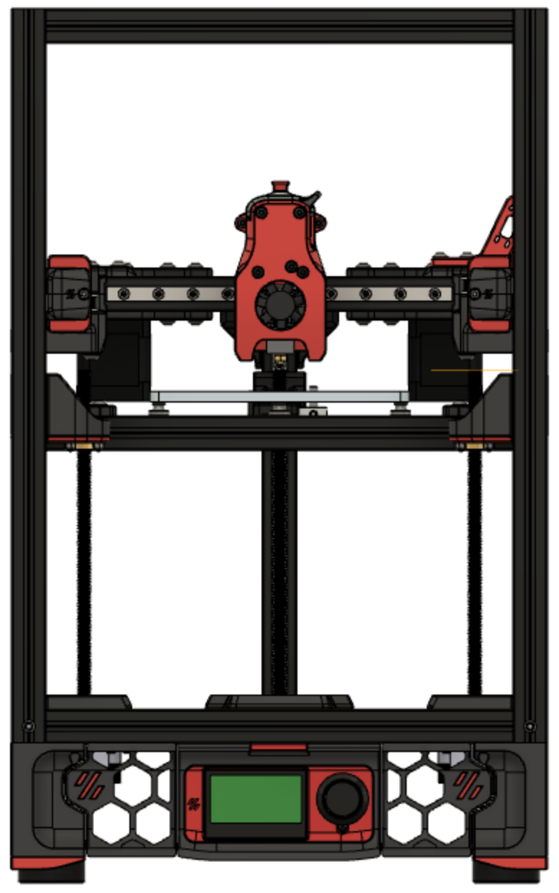
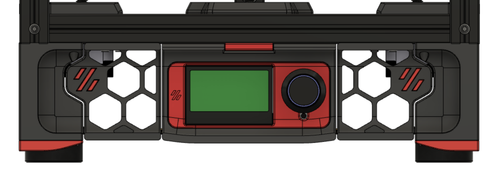
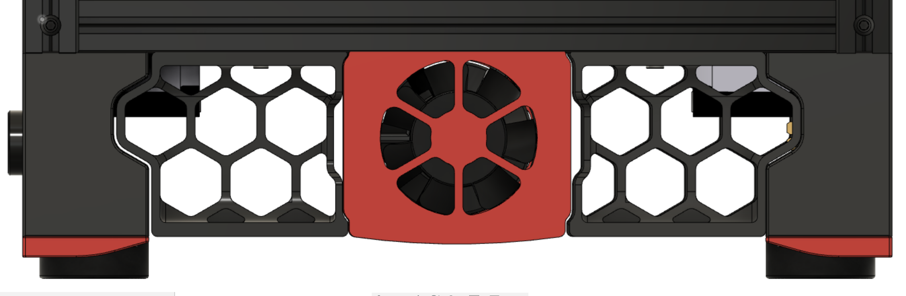
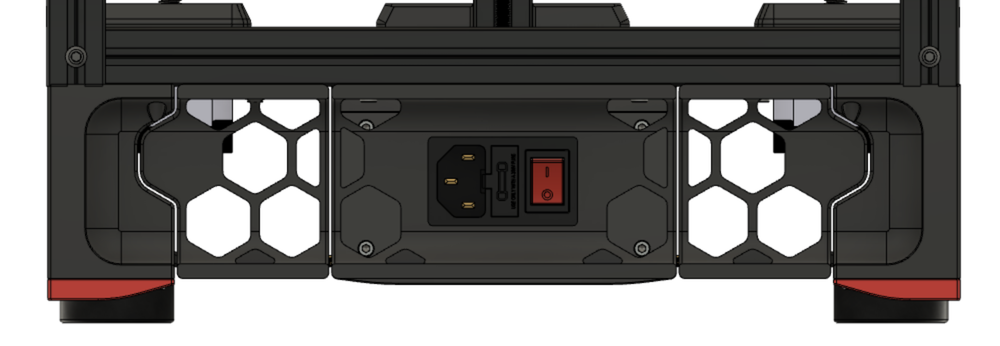
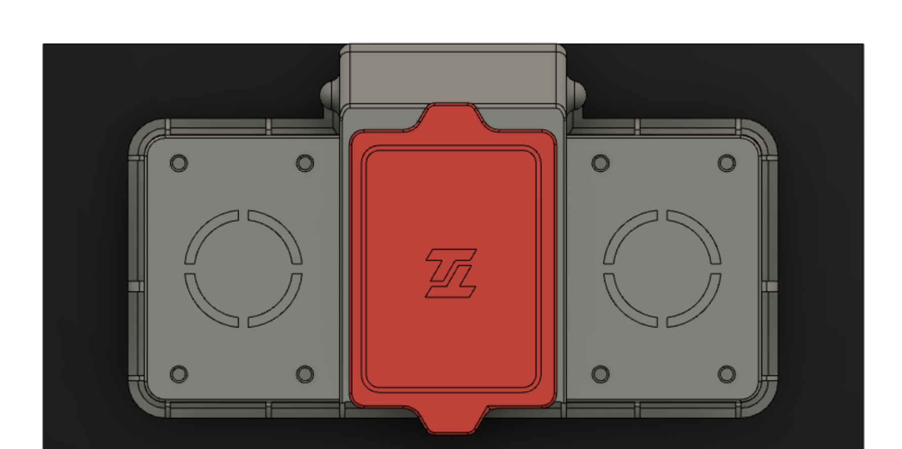

# Tiny-T

Tiny-T is a Voron Trident with build volume 150mm^3. **This is currently a work in progress.**

<p align="center">
  
</p>


## Frame Specs

If ordering from Misumi, these are the specs:

```
Misumi HFSB5-2020-425-LCP-RCP-AV260		4 (corner extrusion)
Misumi HFSB5-2020-270-TPW 			9 (top, bottom, front[top/bottom], rear top extrusions)
Misumi HFSB5-2020-270-AH135-TPW 		1 (rear bottom extrusion)
Misumi HFSB5-2020-230-LTP			1 (rear Z extrusion)
Misumi HFSB5-2020-230				1 (x gantry extrusion)
Misumi HFSB5-2020-140				1 (rear gantry extrusion)
Misumi HFSB5-2020-270-AH135			1 (bed extrusion)
Misumi HFSB5-2020-132-LTP			1 (bed extrusion)
```

Note: The configurator gives 400mm for the corner extrusions, I added 25mm to give more clearance when changing filaments.

## Components

- 150mmx150mm bed - [Mandala Roseworks](https://www.mandalaroseworks.com/shop/tiny-t)
- 120mmx120mm heating pad - [Keenovo](https://keenovo.store/collections/standard-keenovo-silicone-heaters/products/keenovo-square-silicone-heater-3d-printer-build-plate-heatbed-heating-pad?variant=38120586870970)
- 3 V0.1 Z Stepper motor with 150mm lead screw - [Fabreeko](https://www.fabreeko.com/products/ldo-42sth25-1004cl200evrn-v0-1-z-motor?_pos=9&_sid=546ac732a&_ss=r)

## Linear Rails

For Afterburner builds

```
Linear Rail MGN9H 200mm		5
Linear Rail MGN12H 200mm	1
```

For Mini Afterburner builds

```
Linear Rail MGN9H 200mm		6
```

## Images

### Front Skirts



### Side Skirts



### Rear Skirts



### Nevergrater (air filter)

