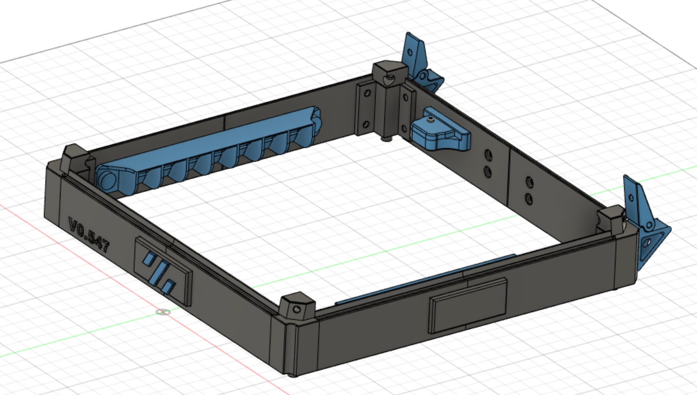
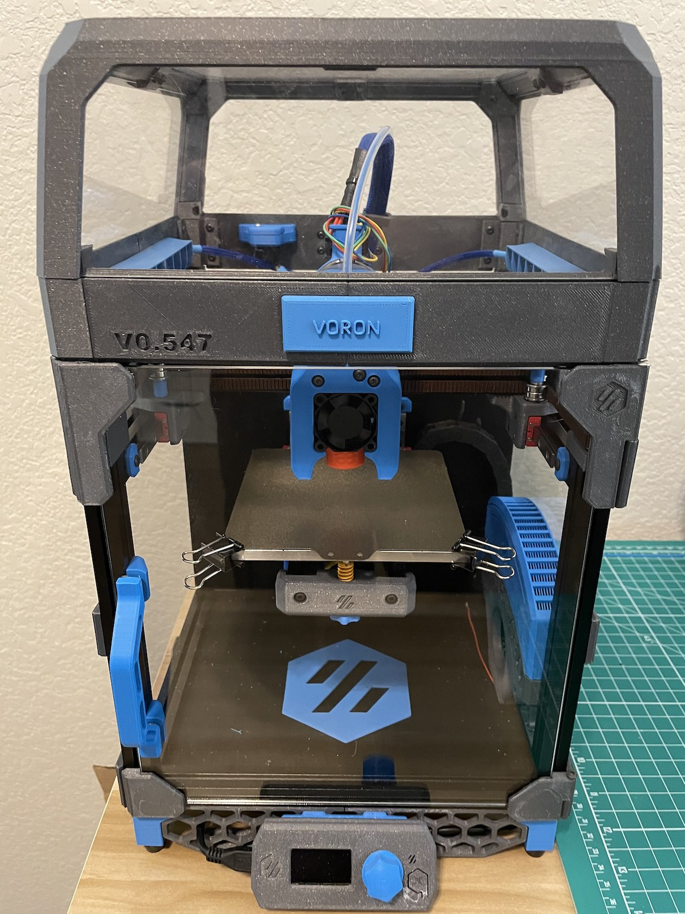
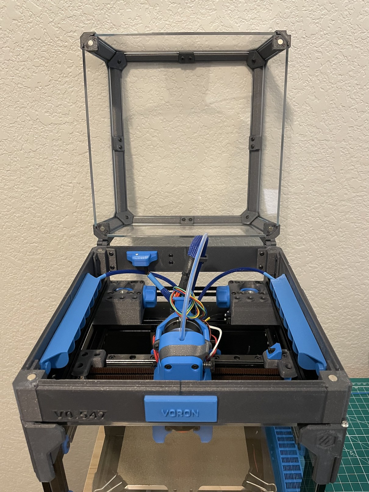
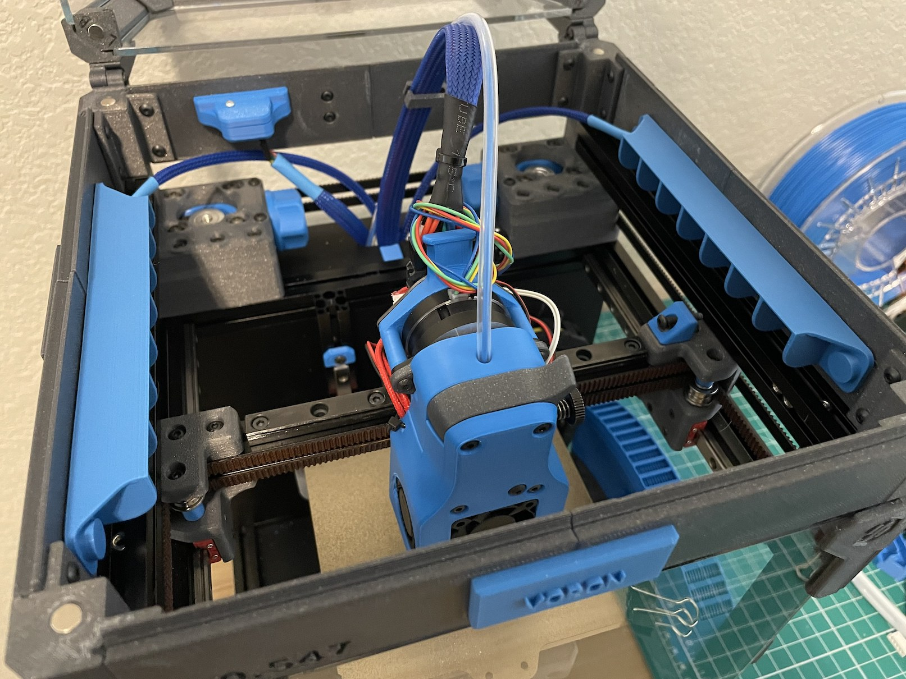

# V0 Utility Belt

The purpose of the "Utility Belt" is to provide extra room betweek the frame and the top hat. Currently the design provides 
mounts for LEDs and BME280, but the CAD file is available for any remix.

## BOM

- 8 - 6x3 magnets (if using LED mounts and BME mount you need extra 12 magnets)
- 32 - M3x8 screws
- 32 - M3 Threaded Insert
- 1 BME280 (Optional)
- 1 LED Strip - cuttable (Optional)

## Remixes

Huge THANKS to the following Voron owners who provided their CAD files for their mods to be adapted to the Utility Belt.

rcfishhunt - LED mount
Mike - tophat hinges
theFPVgeek - BME mount
Charles - [Slim Handles](https://github.com/VoronDesign/VoronUsers/tree/master/printer_mods/Ch4rlesB/V0_Handles_Slim)

